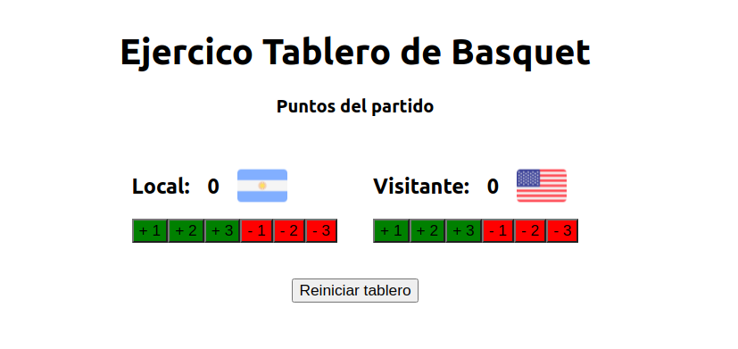
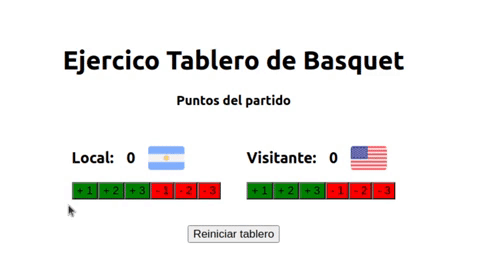

<p align='left'>
  
</P>

# `Trabajo práctico Extra - Tablero de Basquet (optativo) con funciones`

## `Instalación de dependencias:`

Ingresar a la carpeta `tablero-con-funcion`, donde se encuentra el archivo `package.json` y ejecutar el siguiente comando para instalar todas las dependencias:

```
npm install
```

Una vez que se instaló todas las dependencias ya podemos levantar nuestra aplicación con el comando:

```
npm start
```

Su aplicación debería verse de la siguiente manera:



<br><br>

## Consignas

En la carpeta `tablero_components` hay dos componentes realizados con clases `Equipo.jsx` y `Tablero.jsx`.

- Deben convertir estos componentes de clases en componentes de función.

Resultado final:



---

---

[Subir al índice](#top)
