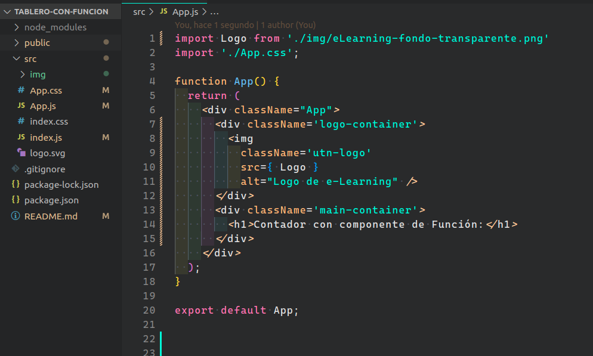
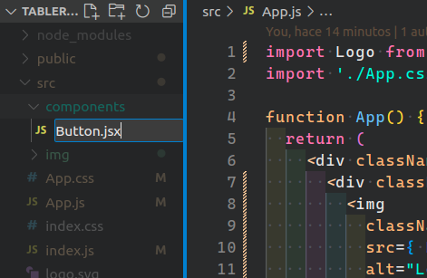
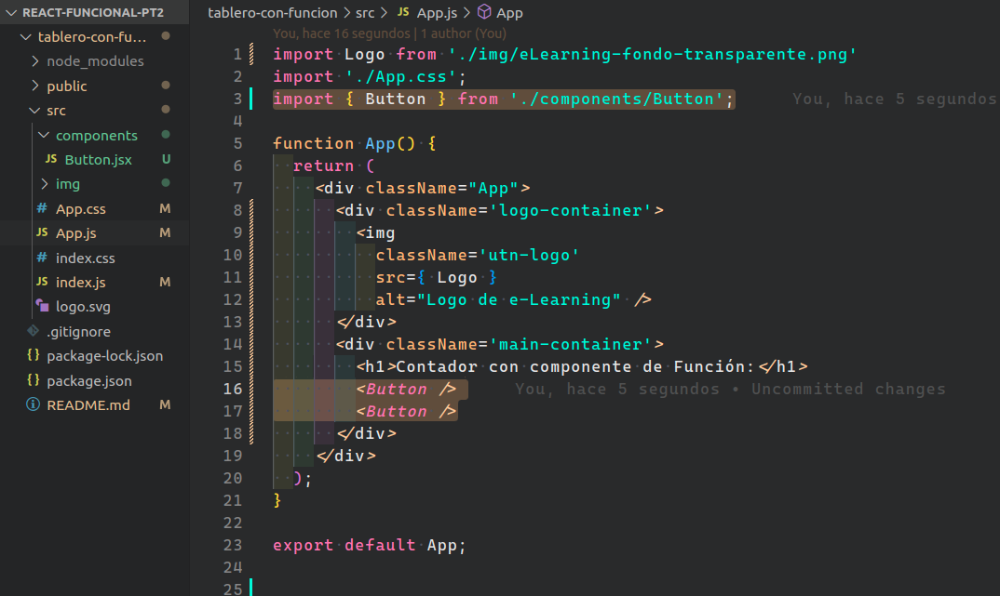
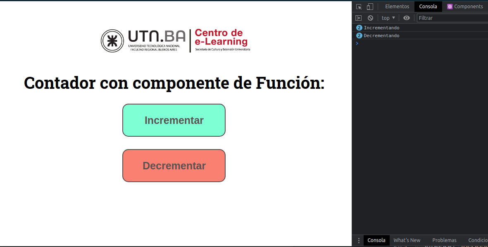
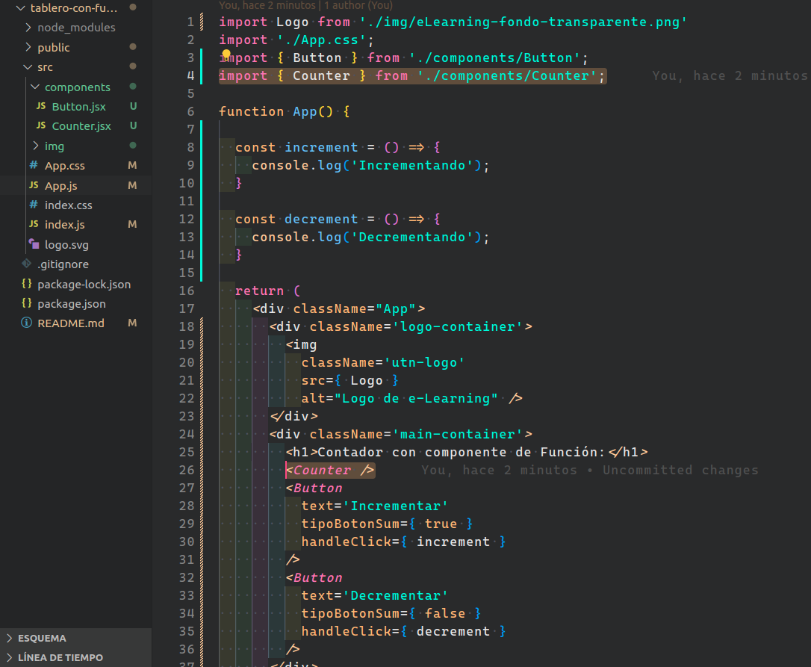
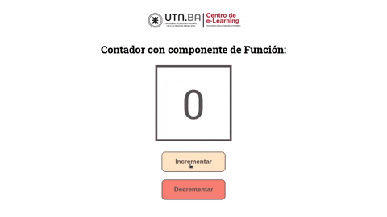
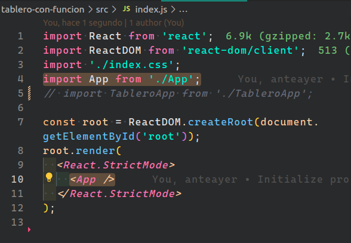

<p align='left'>
  
</P>

# `Ingresando al Módulo II`

## `Presentación:`

En este caso crearé una aplicación e iré explicando paso por paso algunos conceptos para que ustedes puedan trabajar con el "Tablero de Basquet" del ejercicio anterior, pero esta vez, cambiando a componentes de función.

---

---

<a id="top"></a>

## `Bloques temáticos:`

- [**Aplicación Contador**](#item1)
- [**Creando mi primer componente**](#item2)
- [**Componente Contador**](#item3)
- [**Actualizando estado**](#item4)

---

---

<a id="item1"></a>

## `Aplicación Contador`

Vamos a conocer el inicio de la aplicación `App.js` que se puede inyectar en `index.js`.



Como pueden notar, está algo cambiado al código que viene por defecto en `create-react-app`. Tenemos un `div` con la clase `App` que va a envolver toda nuestra aplicación, y dentro un contenedor para nuestro logo y otro para nuestro contenido principal, que por el momento, sólo tiene un `h1`. En esta guía no entraremos en detalles con los estilos en general.

El resultado del código anterior es este:


---

---

<a id="item2"></a>

## `Creando mi primer componente`

Dentro de mi carpeta `src` creare una nueva carpeta llamada `components`, dentro de esta voy a crear mi primer componente el cual será un botón. Lo llamaré `Button.jsx`.



Este componente funcional estará compuesto por el siguiente código:

```js
import React from "react";

export const Button = (props) => {
  return <button>{props.text}</button>;
};
```

Mi componente va a recibir información por props, en este caso es un texto. Quiero que noten que yo al crear el componente de función `Button`, a la vez ya lo estoy exportando para ser inyectado. En mi caso yo me siento más cómodo así, pero también pueden exportar en una línea por debajo de dicho componente. Esto fue explicado en clases, pero vale la pena volver a mencionarlo.
Por otro lado, hay algo que también fue visto en clase y va a simplificar bastante nuestro código. Esto es la desestructuración. ¿Lo recuerdan?

Desestructuración:

```js
import React from "react";

export const Button = ({ text }) => {
  return <button>{text}</button>;
};
```

Mucho más prolijo, ¿Verdad?.

Sabemos que nuestro botón va a tener una clase para hacerlo un poco más bonito. ¿Pero qué pasa si yo quiero darle distintos estilos acorde al tipo de botón que sea?
Bueno, una solución sería recibir una prop más que sea un booleano diciéndome que un tipo de botón es `true` voy a asignarle una clase, de lo contrario otra. Y para lograr esto, usaré un operador ternario de JavaScript para nuestras clases condicional.

```js
import React from "react";

export const Button = ({ text, tipoBotonSumar }) => {
  return (
    <button className={tipoBotonSumar ? "btn-incrementar" : "btn-decrementar"}>
      {text}
    </button>
  );
};
```

Vamos a analizar más detenidamente que está haciendo mi código en la clase. En primer lugar lo que hice fue abrir llaves ya que utilizaré una expresión de `JavaScript`. La misma es una variable con un valor booleano que me estará llegando por props, si su valor es `true` va a retornar mi la clase `btn-incrementar`, caso contrario va a retornar la clase `btn-decrementar`.

Bueno, ahora para terminar en este componente solo nos queda pensar en qué pasará cuando se haga clic en el botón. Aquí es donde entra el concepto de Event Listener `onClick()`. Esta función también la recibiremos como props y va a depender del tipo de botón si incrementa o decrementa.

```js
import React from "react";

export const Button = ({ text, tipoBotonSumar, handleClick }) => {
  return (
    <button
      className={tipoBotonSumar ? "btn-incrementar" : "btn-decrementar"}
      onClick={handleClick}
    >
      {text}
    </button>
  );
};
```

Eso es todo. Hemos terminado nuestro componente `Button.jsx`, el mismo recibe tres props. El texto que se mostrará en el botón, la clase que será asignada según el tipo de botón, y una función que se va ejecutar cuando se haga clic en el botón.

Podemos pasar a nuestro componente padre que es `App.js` y ya llamar a nuestro componente `Button.jsx`, ya que será el encargado de renderizar el mismo.



Como ya sabemos este botón va necesitar tres props. Así que vamos por ello y ya creemos las funciones que debemos pasar como props a nuestro Event Listener del componente `Button.jsx`, que temporalmente, vamos a asignarles un `console.log()` a cada una de estas y asegurarnos de que funcionan correctamente.

```js
import Logo from "./img/eLearning-fondo-transparente.png";
import "./App.css";
import { Button } from "./components/Button";

function App() {
  const increment = () => {
    console.log("Incrementando");
  };

  const decrement = () => {
    console.log("Decrementando");
  };

  return (
    <div className="App">
      <div className="logo-container">
        
      </div>
      <div className="main-container">
        <h1>Contador con componente de Función:</h1>
        <Button
          text="Incrementar"
          tipoBotonSum={true}
          handleClick={increment}
        />
        <Button
          text="Decrementar"
          tipoBotonSum={false}
          handleClick={decrement}
        />
      </div>
    </div>
  );
}

export default App;
```

Como se puede apreciar en la imagen, en cada botón le estoy pasando distintas props, que esto es lo que los va a diferenciar uno del otro. En cada uno de estos, le voy a pasar una función distinta. Un botón imprime en consola "Incrementando" y el otro "Decrementando". Ya realizaremos la lógica correspondiente a cada una de ellas.

Por ahora veamos este resultado.



---

---

<a id="item3"></a>

## `Componente Contador`

Bien, ya terminado nuestro componente de botón ahora debemos pasar a crear el componente del contador.
En nuestra carpeta `components` voy a crear un nuevo archivo llamado `Counter.jsx` y dentro de este pondré el siguiente código.

```js
import React from "react";

export const Counter = ({ quantity }) => {
  return <div className="contador">{quantity}</div>;
};
```

Listo, así de fácil hemos terminado este componente. He creado un componente con un `div` contenedor que dentro tiene la prop que recibo, que será el valor de mi contador.

Ahora ya lo podemos inyectar en nuestro componente padre también.
Volvemos a `App.js` y lo importamos e inyectamos. Yo lo pondré por encima de mis componentes de botones.



En este momento mi contador no se va a mostrar porque aún no le he pasado la prop que necesita. Para hacer eso vamos a tener que crear nuestra variable contador y una función que cambie su estado. Como vimos en clase esto lo resolvemos con `useState Hook`.

Veamos cómo queda el código ahora agregando `useState` y pasándole la prop a mi componente `Counter.jsx`:

```js
function App() {
  const [counter, setCounter] = useState(0);

  const increment = () => {
    console.log("Incrementando");
  };

  const decrement = () => {
    console.log("Decrementando");
  };

  return (
    <div className="App">
      <div className="logo-container">
        
      </div>
      <div className="main-container">
        <h1>Contador con componente de Función:</h1>
        <Counter quantity={counter} />
        <Button
          text="Incrementar"
          tipoBotonSum={true}
          handleClick={increment}
        />
        <Button
          text="Decrementar"
          tipoBotonSum={false}
          handleClick={decrement}
        />
      </div>
    </div>
  );
}
```

[Subir al índice](#top)

---

---

<a id="item3"></a>

## `Actualizando estado`

Lo que nos queda por realizar es conectar nuestros botones con nuestro componente contador. Es decir, que al hacer un clic en uno de los botones vamos a actualizar este estado incrementando o decrementando el mismo.

En nuestras funciones creadas, vamos a cambiar el `console.log()` por la función `setCounter` de nuestro `useState`. En la función `increment` vamos a llamar la función `setCounter` y dentro le pasaremos el valor actual `counter` + 1. De una forma similar lo haremos en la función `decrement`, pero esta vez el valor actual `counter` - 1.

El resultado final del código sería el siguiente:

```js
function App() {
  const [counter, setCounter] = useState(0);

  const increment = () => setCounter(counter + 1);

  const decrement = () => setCounter(counter - 1);

  return (
    <div className="App">
      <div className="logo-container">
        
      </div>
      <div className="main-container">
        <h1>Contador con componente de Función:</h1>
        <Counter quantity={counter} />
        <Button
          text="Incrementar"
          tipoBotonSum={true}
          handleClick={increment}
        />
        <Button
          text="Decrementar"
          tipoBotonSum={false}
          handleClick={decrement}
        />
      </div>
    </div>
  );
}
```

Y así es cómo se vería mi aplicación:



En caso de querer probar la aplicación, la misma está en este proyecto. Debe cambiar las siguiente líneas en `index.js` de la carpeta `src` para renderizar esta aplicación:



Esto es solo por si quiere probarla. Para trabajar en con la tarea debe dejar inyectado la aplicación `TableroApp.js`.

---

---

<br><br>

[Subir al índice](#top)
